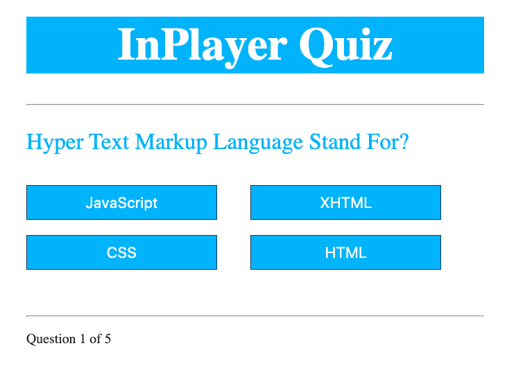
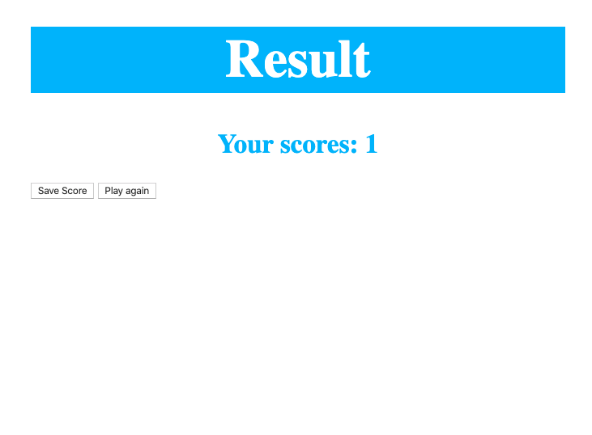

# Build a Quiz App with HTML, CSS, and JavaScript

## 1. Create and Style the Home Page

Create the home page along with a good chunk of the necessary CSS.

I encourage you all to take a look at Emmet snippets for generating HTML and CSS.

Resources

- [Emmet in Visual Studio Code](https://www.youtube.com/watch?v=5guZjNDcVnA)
- [Understanding REM Units](https://www.sitepoint.com/understanding-and-using-rem-units-in-css/)
- [A Complete Guide to Flexbox](https://css-tricks.com/snippets/css/a-guide-to-flexbox/)

## 2. Display Hard Coded Question and Answers

Load questions from a hard coded array and iterate through available questions as the use answers them.

Resources

- [Creating Code Snippets in Visual Studio Code](https://www.youtube.com/watch?v=K3gLlZm-m_8)
- [Using Data Attributes](https://developer.mozilla.org/en-US/docs/Learn/HTML/Howto/Use_data_attributes)
- [Document Query Selector](https://developer.mozilla.org/en-US/docs/Web/API/Document_object_model/Locating_DOM_elements_using_selectors)
- [Document Get by ID](https://developer.mozilla.org/en-US/docs/Web/API/Document/getElementById)
- [Spread Operator](https://developer.mozilla.org/en-US/docs/Web/JavaScript/Reference/Operators/Spread_syntax)
- [Arrow Functions](https://developer.mozilla.org/en-US/docs/Web/JavaScript/Reference/Functions/Arrow_functions)

## 3. Display Feedback for Correct/Incorrect Answers

Check the user's answer for correctness and display feedback to the user before loading the next question.

Resources

- [Bootstrap 4 Colors](https://www.w3schools.com/bootstrap4/bootstrap_colors.asp)
- [Triple vs Double Equals](https://codeburst.io/javascript-double-equals-vs-triple-equals-61d4ce5a121a)

## 4. Create Head's Up Display (HUD)

Create a Heads Up Display (HUD) for our quiz app. This will display the user's score and current question number.

Resources

- [ES6 Template Literals](https://developer.mozilla.org/en-US/docs/Web/JavaScript/Reference/Template_literals)

## 5. Create and Style the End Score Page

Create our End page where we will display the user's achieved score. This screen will provide a form for saving the score and links for playing again or going home.

## Bonus

### 1. Save High Scores in Local Storage

Save and maintain a high scores array in Local Storage. To do this, we will need to use JSON.stringify() and JSON.parse() to convert our high score array to a string and visa versa.

Resources

- [Local Storage](https://www.w3schools.com/jsref/prop_win_localstorage.asp)

### 2. Load and Display High Scores from Local Storage

Create our High Scores page. We will have to load the high scores from Local Storage, iterate through them, and display them on the screen.

Resources

- [JSON Parse and Stringify](https://alligator.io/js/json-parse-stringify/)
- [Array Sort](https://www.w3schools.com/js/js_array_sort.asp)
- [Array Map](https://www.w3schools.com/jsref/jsref_map.asp)
- [Array Join](https://developer.mozilla.org/en-US/docs/Web/JavaScript/Reference/Global_Objects/Array/join)

### 3. Load Questions From Local JSON File

Move our sample questions from a hard coded array to an external .json file.

